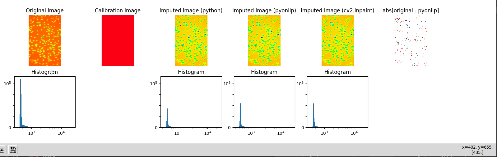

Image pixel-wise mean imputation
================================


This project is about correcting microscope images by using a calibration mask. The main runner (image
loading, plotting) and tests are written in Python, while the core algorithm is implemented in both Python and
pybind11 in C++17.

## Repository structure

```bash
.
├── data
│   ├── processed
│   └── raw
├── docs
├── src
└── test
```

## Installation

### Python environment

The recommended Python version for this project is Python 3.8. To create a `venv` environment and install the
dependencies, run

```bash
make virtualenv
```

This will create a `.venv` directory in the project root. You can then source that environment via

```bash
source $ROOT_DIR/venv/bin/activate
```

where variable `ROOT_DIR` contains the path to the project root folder.

:warning: Do not directly modify `requirements.txt`. Please modify `unpinned_requirements.txt` instead and
run `make update-requirements-txt`, followed by `make virtualenv` to update your local environment.

### Coding style

The repository conforms to PEP8 guidelines. A [pre-commit](.pre-commit-config.yaml) specification with the
default `autopep8` configuration is used.

### Methodology

The main algorithm is written in C++ and binded to Python via `pybind11`. The module repo
is [here](https://github.com/orphefs/pyoniip) and can be manually installed using the following command:

```bash
pip install git+https://github.com/orphefs/pyoniip
```

The analysis and development was conducted on a machine running Ubuntu 20.04 with a 5.13.0-40-generic kernel.

#### Stack:

- vscode (C++)
- pycharm (Python)
- bash
- git
- QGIS Desktop (image analysis)

#### Steps:

- Image mimetypes were verified using `file` and TIF info obtained via `tiffinfo`. This step was conducted to
  verify image headers and bit depth.
- Developed code for [diagnostic plotting](src/utils.py) (images and histograms).
- Pseudocode and [test cases](test/test_impute_image.py) were formulated, and solutions calculated manually in
  order to **verify correctness**.
- Python code was developed to solve all test cases.
- C++ code was developed to optimize the main [algorithm](src/algorithm.py), and tested using the available
  tests. Code was [packaged](https://github.com/orphefs/pyoniip) using `pybind11` and compiled using CMake and setuptools.
-



## Usage

To run the computation pipeline, run the script `src/main.py` while in the virtual environment.

```bash
usage: main.py [-h] [--image IMAGE] [--calibration_image CALIBRATION_IMAGE] [--output_image OUTPUT_IMAGE] [--plot PLOT]

optional arguments:
  -h, --help            show this help message and exit
  --image IMAGE         Path to the uint16 image
  --calibration_image CALIBRATION_IMAGE
                        Path to the float calibration image
  --output_image OUTPUT_IMAGE
                        Path to the imputed image
  --plot PLOT           Display diagnostic plots

```

Plotting is off by default.

## Tests

To run tests, [source the pip environment](#installation) and run `pytest` on the root directory. The command
will collect all tests in the `test` directory.

This repository also implements a test automation workflow on Github Actions.
